[cover](static/assets/delayboard.jpg)

# Airline Delays Prediction using Machine Learning 
#### Project 4: Northwestern Data Science Bootcamp 2022
## Contributors
  - Connor Grant
  - Alfredo Garcia
  - Yousuf Amin AlFatwa
  - Neel Patel

## Table of Contents
  - [Description](#description)
  - [Data Source](#data-source)
  - [Technologies Used](#technologies-used)
  - [Models Used](#models-used)
  - [Output](#output)

# Description 

## Data Source 
  - https://www.kaggle.com/code/dongxu027/airline-delays-eda-deep-dive-lessons-learned/data

## Technologies Used 
  - Pandas (Jupyter notebook)
  - Supervised Machine Learning
  - Matplotlib
  - HTML / CSS / Bootstrap
  - Javascript
  - Tableau
  - Flask
  - D3
  - MongoDB
  

## Models Used
  - Logistic Regression
  - Random Forrest Classifier
  - Confusion Matrix

## Output 
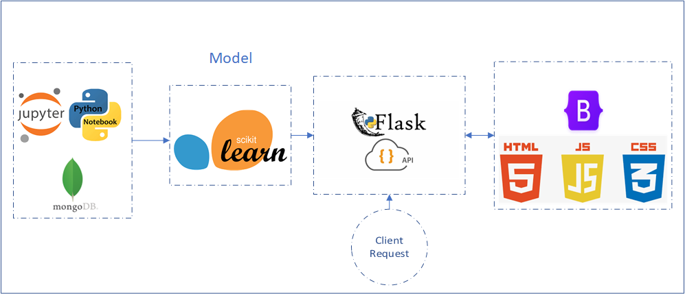
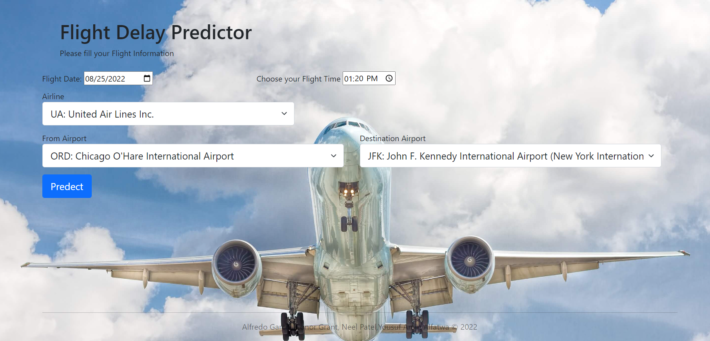
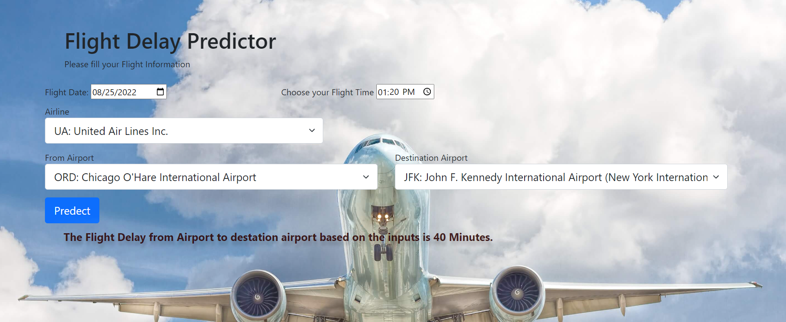

# Tableau graphes 

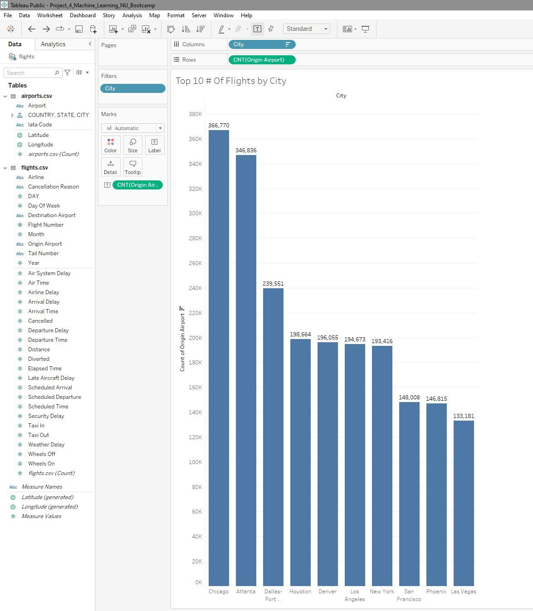)
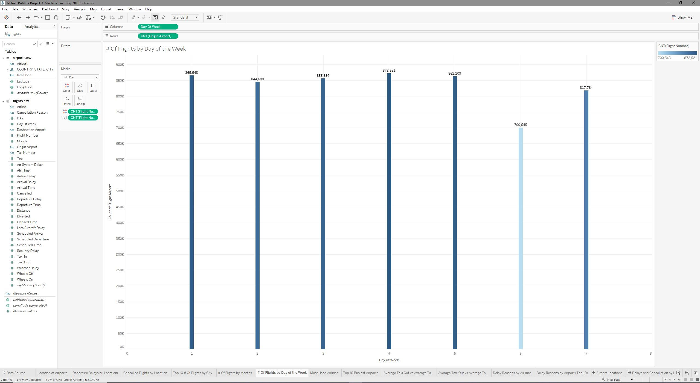

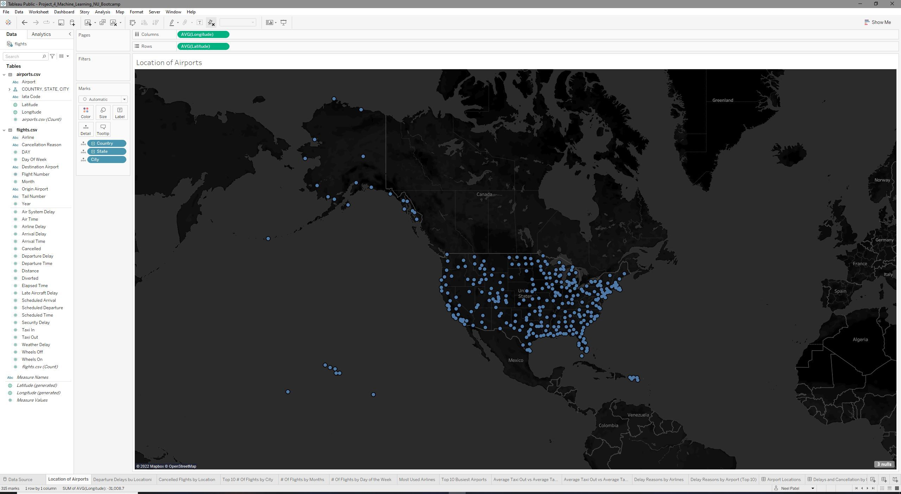

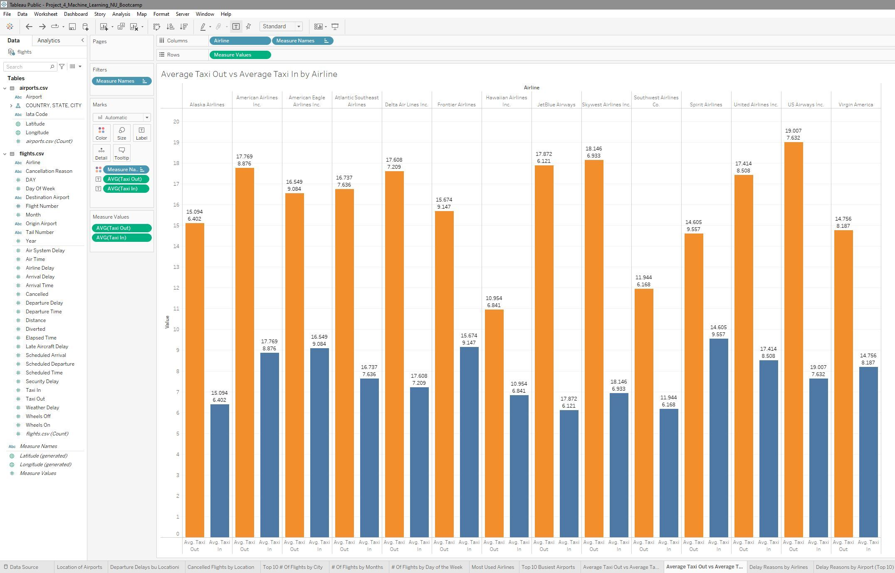

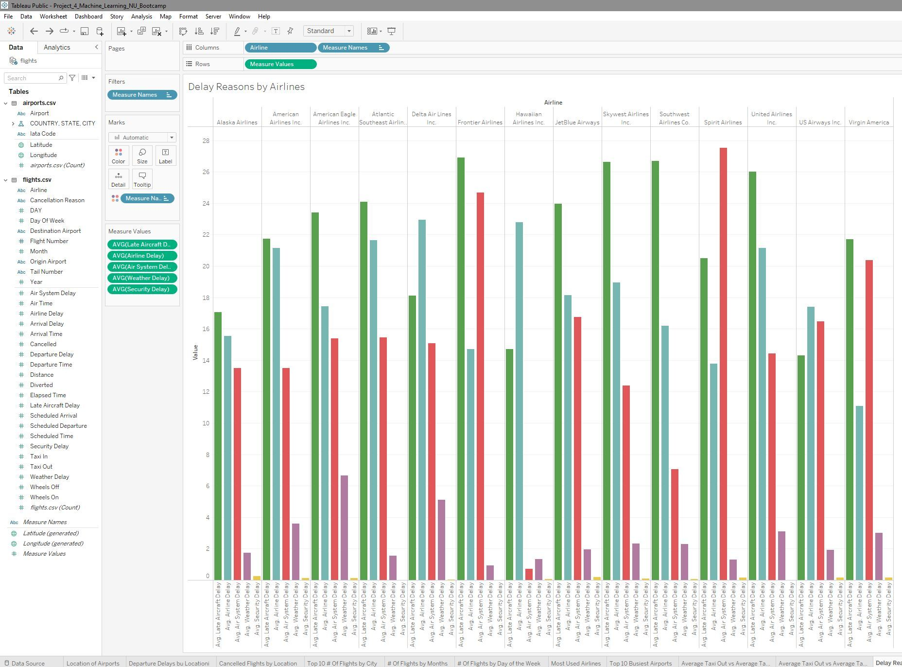
.JPG)
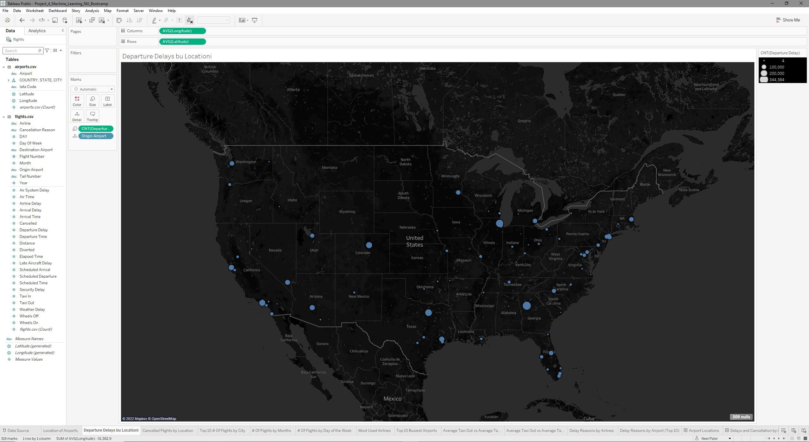
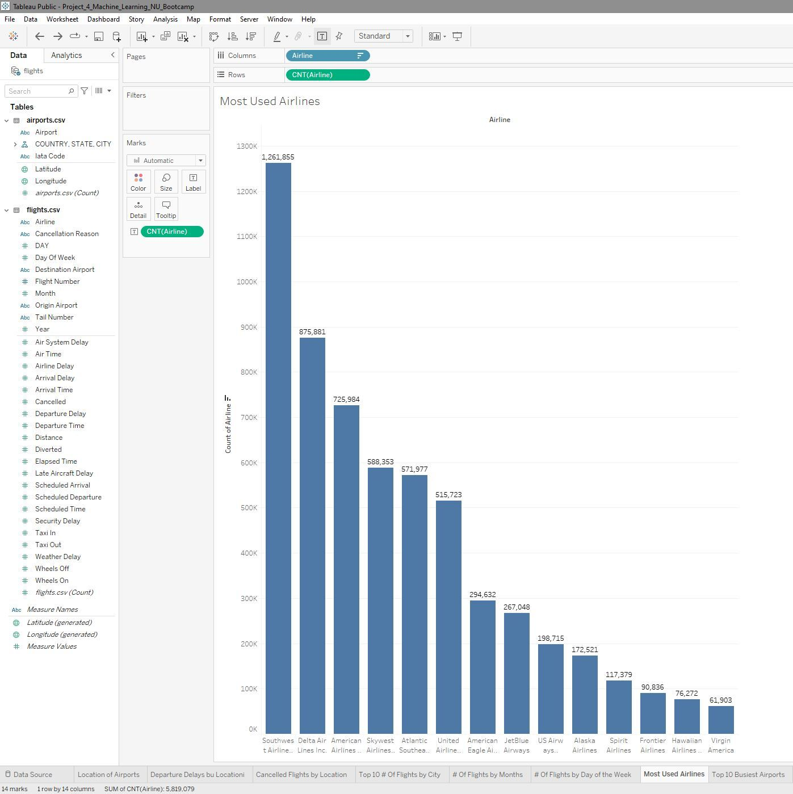
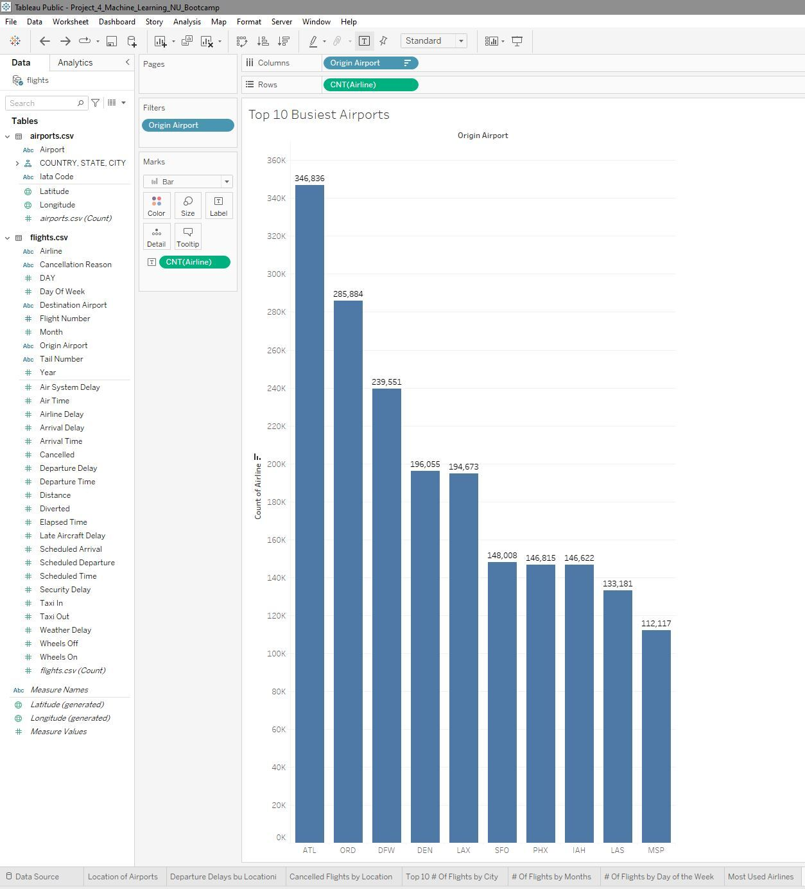

Thank you